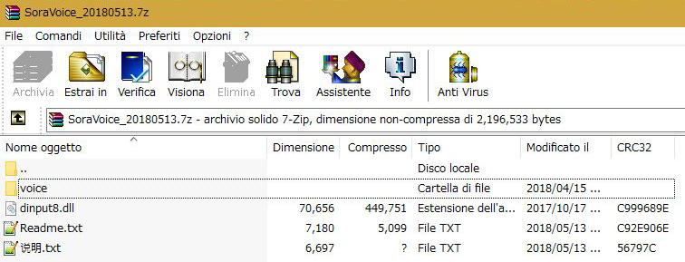
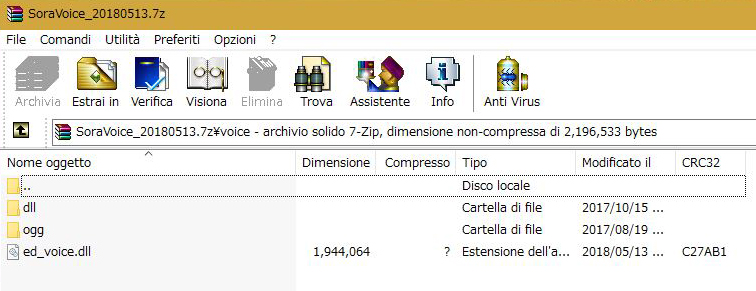
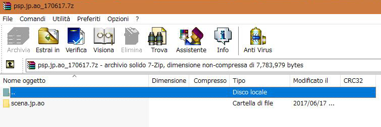
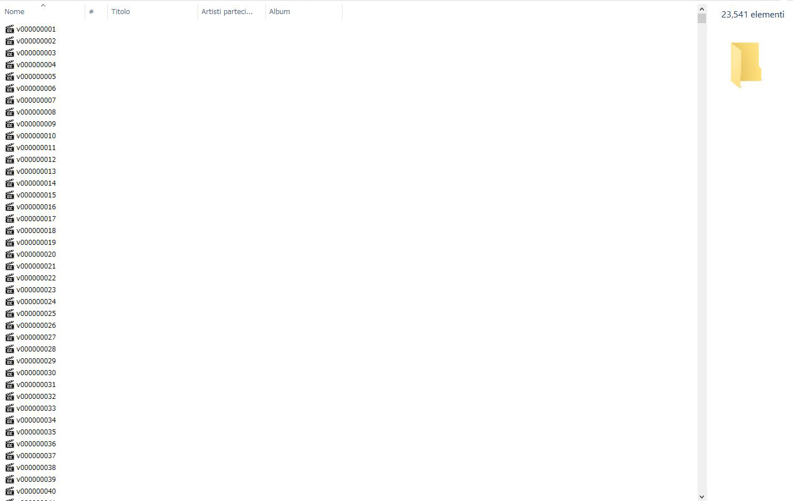
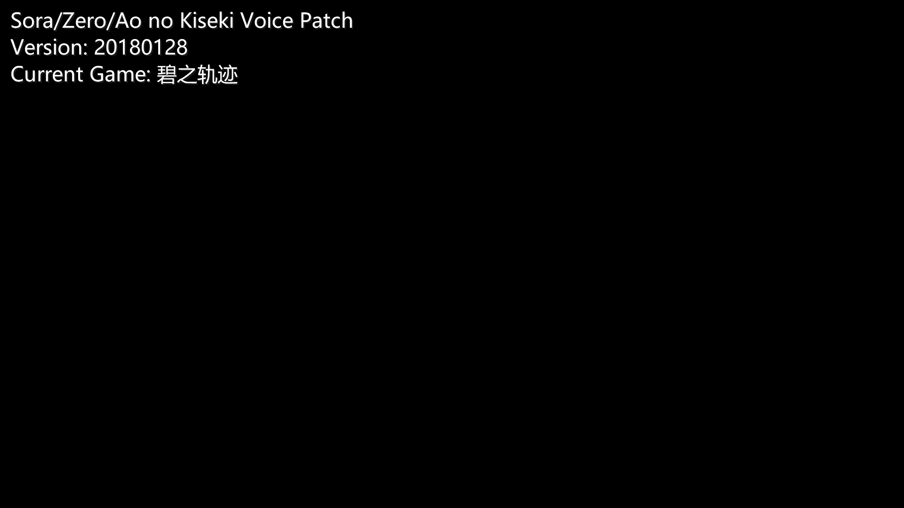

SoraVoice
=========

This project's objective is to bring Full Voice acting to the PC versions of *Sora/Zero/Ao no Kiseki*.
Be aware that the *Evolution* version of these games feature new events. They may or may not have been dubbed, and in the former case, those **WON'T BE** present in game.

All informations about this project can be found at [SoraVoice](https://github.com/ZhenjianYang/SoraVoice).

**NOTE**: This project is licensed under the GPLv3. You MUST copy, distribute and/or modify any code or binaries from this project under this license. See [LICENSE](https://github.com/ZhenjianYang/SoraVoice/blob/master/LICENSE) for details.

## Supported games

|Game Title                    |Publisher | Language         |NOTE
|------------------------------|----------|------------------|----
|*Zero no Kiseki*              |Joyoland  |Chinese Simplified|1.1, JOYO or Cubejoy
|*Ao no Kiseki*                |Joyoland  |Chinese Simplified|1.0, JOYO or Cubejoy
|*Sora no Kiseki FC*           |YLT       |Chinese Simplified|Final version
|*Sora no Kiseki SC*           |YLT       |Chinese Simplified|Final version
|*Sora no Kiseki the 3rd*      |YLT       |Chinese Simplified|Final version
|*Zero no Kiseki*              |Falcom    |Japanese          |
|*Trails in the Sky FC*        |Xseed     |Chinese Simplified|[ED6-FC-Steam-CN](https://github.com/Ouroboros/ED6-FC-Steam-CN)
|*Trails in the Sky FC*        |Xseed     |English           |Steam/GOG/Humble, with latest update
|*Trails in the Sky SC*        |Xseed     |English           |Steam/GOG/Humble, with latest update
|*Trails in the Sky the 3rd*   |Xseed     |English           |Steam/GOG/Humble, with latest update

## Build

You can download built files in [Release](https://github.com/ZhenjianYang/SoraVoice/releases), or build them with VS2017 (Desktop development with C++).   

## Preparation

What you need to grab in **Release** is the archive *SoraVoice_YYYYMMDD.7z*. This zip contains the pre-made folder structure, as you can see in the following screenshot, and all the needed DLLs.

And this is the content of the *voice* folder in the first picture.

To make the Voice Patch work, you need **Voice Scripts** and **Voice Files** for your game.
As ***Voice Scripts*** are a completely different project, they're stored in another page we'll point you at soon.

***Voice Files*** are protected material, so you'll have to make them yourselves by extracting them from a copy of your game, or could *probably* find them somewhere.

**NOTE 1**: If you plan on making them yourselves, you'll usually find what you need in `<Evolution Game Folder>/gamedata/data/talk`.

**NOTE 2**: For ***Sora FC, SC, and the 3rd***, you also need to extract `data/bgm/arrange/ed6501.at9`(or `data/bgm/ed6501.at9`). Keep in mind though that ***Sora FC and the 3rd*** share the same file, while ***Sora SC*** features its own `ed6501.at9`. For those wondering, this is Olivier singing *Kohaku no Ai*.

### Voice Scripts   

**Voice Scripts** are at the very core of the patch, as they call the needed **Voice Files** line by line. They contain all the dialogues, and because of that, obviously, each set of **Voice Scripts** is tied to a specific version of the games.

[ZeroAoVoiceScripts](https://github.com/ZhenjianYang/ZeroAoVoiceScripts) is a project about **Voice Scripts** for *Zero no Kiseki* & *Ao no Kiseki*.    

[SoraVoiceScripts](https://github.com/ZhenjianYang/SoraVoiceScripts) is a project about **Voice Scripts** for *Sora no Kiseki*/*Trails in the Sky*.   

***NOTE***: If you're wondering about building the scripts yourselves... don't. You don't have to unless you wanna do it for some reasons. The steps are explained to this specific end, but a proper release is available.  

### Voice Files

They can only be extracted from the *Evolution* version of these games, so you may need a PS Vita/PS TV with HENKaku installed and a copy of the game to dump its data. We assume you have dumped the game.

#### 1. Extract data.psarc

Drag & Drop `<Evolution Game Folder>/gamedata/data.psarc` on [PSArcTool](https://github.com/periander/PSArcTool).   
Or if you have **psarc.exe** from Sony's PS3 SDK, use this command: `psarc.exe extract data.psarc`

Then you will get a folder `data` which contains the extracted data.

**NOTE**: If you find data0.psarc, data1.psarc, ... in the same folder with data.psarc, then extract them all the same way. You can actually drag & drop them all at once, this will open an instance of the command prompt for each data.psarc you want to unpack.

#### 2. Convert at9 files to ogg files.   

- Tools needed:   
  **at9tool.exe**, it can only be found in Sony's PS3 SDK.   
  [**oggenc2**](http://www.rarewares.org/ogg-oggenc.php).   

1. Create a folder `at9`, and copy (or cut if you like) the ***content*** of the extracted folder `data/talk` into it.   
- **NOTE**: For ***Sora FC, SC, and the 3rd***, you also to need copy `data/bgm/arrange/ed6501.at9`(or `data/bgm/ed6501.at9`) into `at9`. Again, keep in mind that ***Sora FC and the 3rd*** share the same file, while ***Sora SC*** features its own `ed6501.at9`.

2. Open your text editor (Notepad, Notepad++, whatever else you prefer), copy the following code into it, and **Save as** > Select **All Files (format wise)** > Input **Convert.bat** > **Save**.   
~~~
@echo off
mkdir wav
mkdir ogg
for /f "delims=" %%i in ('dir /s /b /a-d at9\*.at9') do (
title converting %%~ni.at9
at9tool.exe -d -repeat 1 "%%i" "wav\%%~ni.wav"
oggenc2.exe -Q -q 6.00 -n "ogg\%%~ni.ogg" "wav\%%~ni.wav"
)
~~~
- **NOTE**: `-q 6.00` sets ogg files' quality to 6.00, you can choose another value between 2 and 10 (higher value means higher quality and larger filesize). 

3. Put **at9tool.exe**, **oggenc2.exe** and **Convert.bat** together with the folder `at9`, then double click **Convert.bat**.   
- **NOTE**: This step may take a very long time, depending on your PC specs, as there are tenth of thousands of files to encode. Please, be patient.   

Then, you will get **Voice Files** in the `ogg` folder. 

## Apply the patch

**NOTE**: The original game files will remain untouched.

1. Extract the files you downloaded from [Release](https://github.com/ZhenjianYang/SoraVoice/releases), and copy the `voice` folder and
**dinput8.dll** into `<Game Folder>` (where the game EXE is). It'll look like the following picture.  

2. Download the **Voice Scripts** linked above. Inside the archive, you'll find a folder named `scena.xx.xx`.
***xx.xx*** stands for scripts language (JP, CH, EN) and game (Ao, Zero and so on).

Extract `scena.xx.xx` inside `<Game Folder>/voice/`, and remove the ***xx.xx***. It should look like the following picture.

3. Copy all **Voice Files** into `<Game Folder>/voice/ogg/`   
   **NOTE**: Remember that you also need **ed6501.ogg** inside this folder when it comes to ***Sora FC / SC / the 3rd***. Remember that ***Sora SC*** features its own ***ed6501.ogg***.

4. (**About *Sora no Kiseki*/*Trails in the Sky***) The trilogy ***DOES NOT*** need the `dll` folder inside `<Game Folder>/voice/`, as all three games provide them already.

5. If you did it right, upon launching the game, this message will pop up.

This will also generate `ed_voice.ini` inside `<Game Folder>/voice/`, which contains settings like the auto-scroll.

**NOTE**: To disable the patch, simply rename **dinput8.dll** to something else.

### About dsound.dll

For *Sora no Kiseki*/*Trails in the Sky*, you can use **dsound.dll** instead of **dinput8.dll**, in case you couldn't use the latter for some reasons (e.g. another MOD also uses dinput8.dll).   

## About the configuration file   

It contains every setting's description, so we're not gonna go too much into details here. Please, check the configuration file for further infos.   
Just **NOTE**:   
1. The default **Volume** is 100 (maximum), maybe too loud for *Sora*, because *Sora*'s voices are louder than *Zero*/*Ao*'s.   
2. With default setting, all dialogues will be auto-scrolled. You can disable this feature or let it scroll voiced dialogues only.
   And the default timing settings for auto-scroll are designed for Chinese/Japanese versions, they may not be suitable for English versions.
3. You can hide the pop up message at launch by changing line 56 `ShowInfo` to 0.

## External libraries used in this project   
-   [libVorbis & libOgg](https://www.xiph.org/), licensed under the [BSD-like license](https://www.xiph.org/licenses/bsd/).   
-   DirectX8 SDK. From Microsoft.    
-   DirectX9 SDK. Only header files are needed, I got them from [minidx9](https://github.com/hrydgard/minidx9).

## Special Thanks   
[Ouroboros](https://github.com/Ouroboros), developed decompile/compile tools for Kiseki series games, and provided many awesome hook ideas. 

------------------------------------------------------------------------

------------------------------------------------------------------------

SoraVoice
=========

PC游戏《空·零·碧之轨迹》系列的语音补丁。

您可以在[SoraVoice](https://github.com/ZhenjianYang/SoraVoice)获取到关于本项目的全部信息。

**注意**:  本项目基于GPLv3开源协议, 对本项目的任何代码或二进制文件的复制、修改、分发需遵循此协议。
具体细节请参见[LICENSE](https://github.com/ZhenjianYang/SoraVoice/blob/master/LICENSE)文件。

## 编译

您可以从[Release](https://github.com/ZhenjianYang/SoraVoice/releases)获取已编译好的文件, 或者用VS2017(使用c++的桌面开发)来进行编译。

## 支持的游戏

|游戏标题          |发行商  |语言    |备注
|------------------|--------|--------|---------------------------
|零之轨迹          |欢乐百世|简体中文|1.1, JOYO平台版, 方块游戏
|碧之轨迹          |欢乐百世|简体中文|1.0, JOYO平台版, 方块游戏
|空之轨迹 FC       |娱乐通  |简体中文|最终版
|空之轨迹 SC       |娱乐通  |简体中文|最终版
|空之轨迹 the 3RD  |娱乐通  |简体中文|最终版
|零之轨迹          |Falcom  |日文    |
|空之轨迹 FC       |Xseed   |简体中文|[ED6-FC-Steam-CN](https://github.com/Ouroboros/ED6-FC-Steam-CN)
|空之轨迹 FC       |Xseed   |英文    |Steam/GOG/Humble, 需安装最新升级
|空之轨迹 SC       |Xseed   |英文    |Steam/GOG/Humble, 需安装最新升级
|空之轨迹 the 3RD  |Xseed   |英文    |Steam/GOG/Humble, 需安装最新升级

## 准备

为了能正常使用语音补丁,还需要跟游戏对应的**语音脚本**与**语音文件**。   
它们并未包含在本项目中,接下来会说明如何获取它们。

### 语音脚本

**语音脚本**的目的是为了能够让语音补丁知道对白需要的**语音文件**是哪一个。每一个游戏都需要各自的语音脚本。

[ZeroAoVoiceScripts](https://github.com/ZhenjianYang/ZeroAoVoiceScripts)是一个关于《零之轨迹》和《碧之轨迹》的**语音脚本**的项目。    

[SoraVoiceScripts](https://github.com/ZhenjianYang/SoraVoiceScripts)是一个关于《空之轨迹》系列的**语音脚本**的项目。
**注意**: 部分列表中的游戏的语音脚本尚未完成。   

### 语音文件

语音文件只能从游戏对应的Vita版(进化版)游戏中导出。   
所以您可能需要一台安装了HENKaku的PS Vita/PS TV以及一份Vita版游戏来导出游戏数据。   
我们假设您以及导出了游戏数据。

#### 1. 解包data.psarc

将`<Evolution Game Folder>/gamedata/data.psarc`拖放至[PSArcTool](https://github.com/periander/PSArcTool),   
或者,如果您有psarc.exe(来自Sony的PS3 SDK), 可以使用这个命令: `psarc.exe extract data.psarc`

然后您就可以在文件夹`data`中找到解包后的文件。

**注意**: 如果您在data.psarc同目录中找到了data0.psarc, data1.psarc, ... , 用同样的方法解包它们。

#### 2. 将at9文件转换为ogg文件   

- 需要的工具:   
  **at9tool.exe**, 来自Sony的PS3 SDK.   
  [**oggenc2**](http://www.rarewares.org/ogg-oggenc.php).   

1. 新建一个文件夹`at9`, 并复制(或者剪切)解包出来的`data/talk`文件夹到其中。   
- **注意**: 对于 **《空之轨迹》系列**, 您还需复制`data/bgm/arrange/ed6501.at9`(或者`data/bgm/ed6501.at9`)到`at9`。(请特别注意：三作的`ed6501.at9`并不是完全相同的，请务必使用各自的`ed6501.at9`)

2. 打开记事本, 复制以下内容, 并且**另存为...** > 选择**所有文件** > 输入**Convert.bat** > **保存**    
~~~
@echo off
mkdir wav
mkdir ogg
for /f "delims=" %%i in ('dir /s /b /a-d at9\*.at9') do (
title converting %%~ni.at9
at9tool.exe -d -repeat 1 "%%i" "wav\%%~ni.wav"
oggenc2.exe -Q -q 6.00 -n "ogg\%%~ni.ogg" "wav\%%~ni.wav"
)
~~~
- **注意**: `-q 6.00`设置ogg的质量为6.00, 您也可以选择2至10之间的其他值(值越高,质量越好)。

3. 将**at9tool.exe**, **oggenc2.exe**, **Convert.bat**与文件夹`at9`放到一起, 然后双击运行**Convert.bat**。   
- **注意**: 这一步可能会花较长时间, 请耐心等待。   

这样, 您就可以在文件夹`ogg`中找到**语音文件**了。

## 应用补丁

**注意**: 语音补丁不会覆盖任何原有的游戏文件。

1. 将[Release](https://github.com/ZhenjianYang/SoraVoice/releases)中的压缩包解压, 复制文件夹`voice`以及**dinput8.dll**到`<游戏目录>`(游戏的exe文件所在目录)。   

2. 获取**语音脚本**, 将压缩包内的`scena`文件夹解压至`<游戏目录>/voice/`.   

3. 复制所有的**语音文件**到`<游戏目录>/voice/ogg`.   
   **注意**: 对于 **《空之轨迹》系列**, 不要遗漏**ed6501.ogg**。

4. (**对于《零/碧之轨迹》**), 确保`<游戏目录>/voice/dll`下存在**ogg.dll**, **vorbis.dll**以及**vorbisfile.dll**。   
   **注意**: 对于《空之轨迹》系列, 可以删除`dll`文件夹, 因为这个文件夹对于《空之轨迹》系列而言,没有任何用途。 

5. 运行游戏。   

**注意**: 如果您想临时禁用语音补丁, 只需重命名**dinput8.dll**。

### 关于dsound.dll   
对于《空之轨迹》系列, 可以用**dsound.dll**替换掉**dinput8.dll**, 以应对**dinput8.dll**无法使用的情况(比如另一个MOD也使用了dinput8.dll)。 

## 关于配置文件   

语音补丁的配置文件为`<游戏目录>/voice/ed_voice.ini`。配置文件会在游戏启动的时候自动创建。   
由于配置文件夹已对每一个配置项作了详细的说明, 这里便不再重复, 请自行查看配置文件中的说明。   
仅在此**提示**:   
1. 音量**Volume**的默认配置为100(最大)。由于《空》的语音音量要比《零/碧》高出不少, 默认音量对于《空》而言可能过高。   
2. 在默认配置下, 会对全部的对话框启用**自动播放**。 这一特性可以禁用或者仅对有语音的对话框启用。   
   另外, **自动播放**的时间配置的默认值是为中文/日文版专门调整的, 可能并不太适用于英文版。

## 本项目使用的外部库   
-   [libVorbis & libOgg](https://www.xiph.org/), 基于[BSD-like license](https://www.xiph.org/licenses/bsd/)。   
-   DirectX8 SDK。来自微软。    
-   DirectX9 SDK。只用到头文件, 这个工程里的文件是从[minidx9](https://github.com/hrydgard/minidx9)复制过来的。

## 特别感谢   
[Ouroboros](https://github.com/Ouroboros), 开发了轨迹系列游戏脚本的编译/反编译工具, 并提供了各种神奇的Hook思路。

